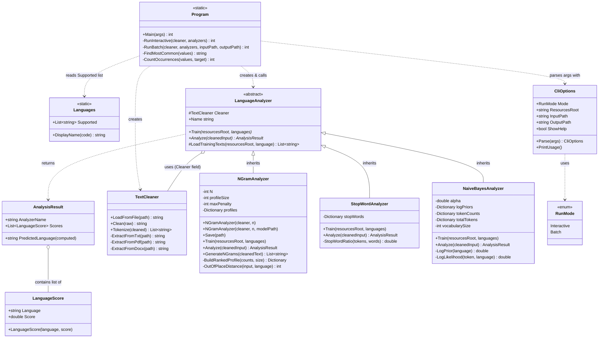

# Class diagram & explanations

---

## Class descriptions

### Data types

| Class | Purpose |
|---|---|
| `LanguageScore` | A pair of (language code, numeric score). One entry in an analyzer's result list. |
| `AnalysisResult` | What one analyzer returns for one input: the analyzer's name, the sorted list of `LanguageScore`s, and the computed `PredictedLanguage` winner. |
| `Languages` | Static helper. Holds the list of supported language codes (`"en"`, `"cs"`, …) and converts codes to display names (`"en"` → `"English"`). |

### Text processing

| Class | Purpose |
|---|---|
| `TextCleaner` | Reads `.txt`, `.pdf`, and `.docx` files. `Clean()` lowercases text and strips everything except letters and apostrophes. `Tokenize()` splits cleaned text into a word list. |

### Analyzer hierarchy

| Class | Purpose |
|---|---|
| `LanguageAnalyzer` | Abstract base class. Holds the shared `Cleaner` field and the shared `LoadTrainingTexts()` helper. Forces every subclass to implement `Train()` and `Analyze()`. |
| `NGramAnalyzer` | Builds a ranked profile of the most common character trigrams for each language. Scores input by measuring how far its trigram ranking differs from each language's profile (Out-of-Place metric). Lower distance = better match. Supports saving/loading the trained model to/from a JSON file. |
| `StopWordAnalyzer` | Loads a list of common short words (stop-words) for each language from `stopwords/`. Scores input by the fraction of its words that appear in each language's stop-word list. Higher fraction = better match. |
| `NaiveBayesAnalyzer` | Counts word frequencies during training and computes log-probabilities. Scores input as `log P(language) + Σ log P(word \| language)` using Laplace smoothing so unseen words don't produce −∞. Higher score = better match. |

### Entry point & CLI

| Class | Purpose |
|---|---|
| `Program` | Entry point. Parses arguments, creates all three analyzers, trains them, then runs either interactive mode (read from console) or batch mode (read from file, write report). |
| `CliOptions` | Holds the parsed command-line settings: run mode, resources root folder, input/output file paths, and the help flag. |
| `RunMode` | Enum with two values: `Interactive` and `Batch`. |

### Key relationships

- `NGramAnalyzer`, `StopWordAnalyzer`, and `NaiveBayesAnalyzer` all **inherit** from `LanguageAnalyzer` — they get `Cleaner` and `LoadTrainingTexts()` for free.
- Every analyzer **uses** `TextCleaner` (via the inherited `Cleaner` field) to read files and split text.
- Every analyzer **returns** `AnalysisResult` objects that contain a sorted list of `LanguageScore` objects.
- `Program` **creates** one `TextCleaner` and one instance of each analyzer, trains them all, then calls `Analyze()` in a loop.
